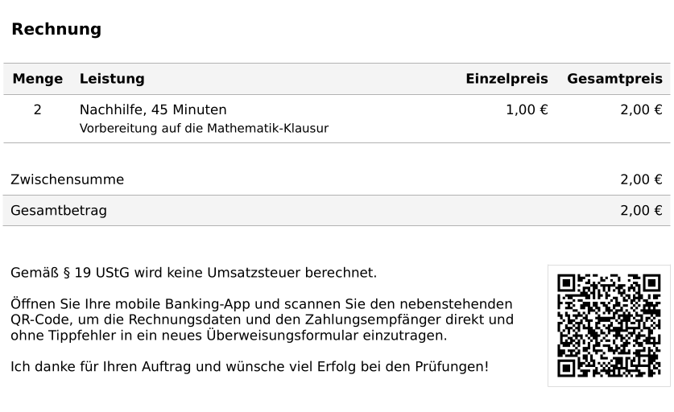

# invoice-girocode

Insert a Girocode into Fakturama invoices.



This systemd service adds a Girocode to each invoice
that is generated by Fakturama
and copies it into a dedicated directory.
The girocode is inserted at the position of a placeholder image.
For this to work the page and the image's index
at which the code should be inserted
needs to be known beforehand.

## Usage

In the `service` directory, copy `example.env` to `.env`
and configure the desired settings.

```
$ cp service/example.env service/.env
$ vim service/.env
```

Afterwards, install the systemd service.
It is enabled and started automatically.

```
# make install
```

Open Fakturama and enable ZUGFeRD XML file creation.
This is required to get metadata about the invoice
in an easily readable format.


You can now go ahead and print an invoice.


You should then see your placeholder image being replaced with a Girocode
that contains the invoice's payment information and your configured bank details.


## Development

```
$ python3 -m venv venv
$ source venv/bin/activate
(venv) $ pip install -U pip
(venv) $ pip install -r requirements.txt
```

## Installing dependencies

```
pip install -U $DEP
pip freeze > requirements.txt
```

## License

This repository is licensed under the MIT license.
See LICENSE for details.

Copyright (c) 2022 Jonas van den Berg
